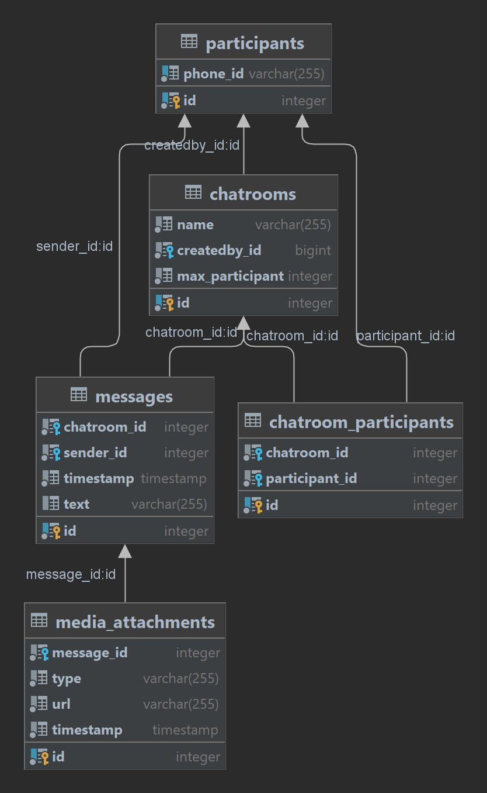

# WhatsApp Chatroom API  Spring Boot Application

Minimal implementation for WhatsApp API 

## Requirements

For building and running the application you need:

- [JDK 17](https://www.oracle.com/java/technologies/downloads/#java17)
- [Gradle](https://gradle.org/)
- [postgresql](https://www.postgresql.org/)

# Future Work

- Proper validation
- Adding security and rate limiting
- Test code

# DB schema

## Running the application locally

There are several ways to run a Spring Boot application on your local machine. One way is to execute the `main` method in the `io.b1ruk.start.whatsAppS` class from your IDE.

Alternatively you can use the [Spring Boot Gradle plugin](https://docs.spring.io/spring-boot/docs/current/gradle-plugin/reference/htmlsingle/) 
